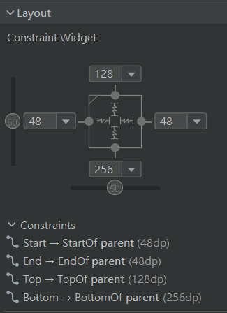
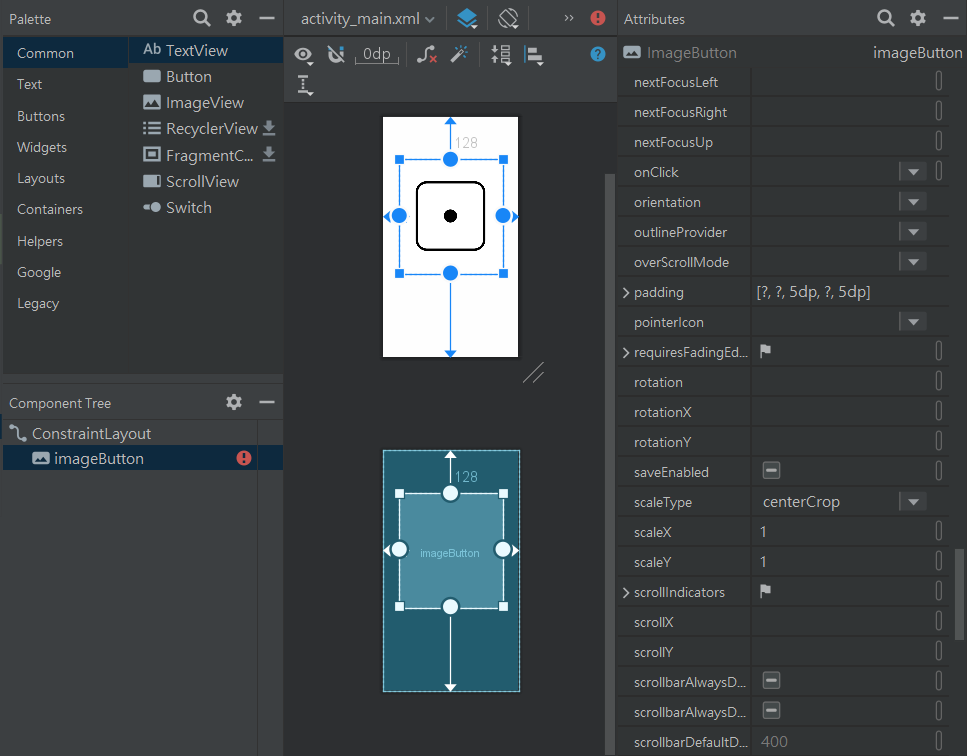
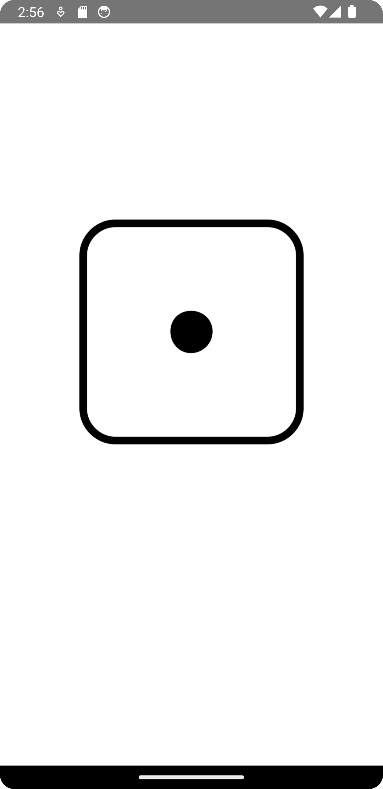

# Lesson 2

## Tasks

Hello everyone! For lesson 2, we will first make the ImageButton look good, then add a little bit of code:
1. Changing the default view to a ConstraintLayout
   <details>
     <summary>What is a ConstraintLayout?</summary>
     A ConstraintLayout is a View which allows you to position and size widgets in a flexible way. By using it, we can position our buttons relative to others, giving us a better looking UI.
   </details>
2. Adding constraints to the ImageButton and editing some of its attributes
3. Changing the background colour of the ConstraintLayout
4. Adding a `roll_dice` function
5. Setting the dice to react when clicked

## Help

Help for some of the tasks above:
1. Check out the component tree. If the thing at the top is not a `ConstraintLayout`, you should change it by right clicking it > Convert view... > ConstraintLayout
2. Now if you click on the ImageButton from the component tree, you can see in the attributes section, there is a new constraint widget section. Click on all the + buttons. For every + button, it means a constraint from that side to its parent is created. The number represents the length of the constraint. Because we will add some text at the bottom in the future, I will make the constraint at the bottom longer.  However, you may realize it still does not look good. To fix this, scroll down to All Attributes and open the list. Scroll down to scaleType and set it to centerCrop. Scroll up to padding and set the top and bottom to something small like 5dp.  As you can see, the button now looks pretty good!
3. Finally, click on the ConstraintLayout, and in All Attributes, click on background. Click on the little pen and choose the white colour of the dice. Now, the background colour of the app will also be the same. It should look something this: 
4. Time to go back to the kotlin file. Near the top, we will add a function called `roll_dice`. It will return a [random number from 1 to 6](https://stackoverflow.com/questions/45685026/how-can-i-get-a-random-number-in-kotlin). Completed code:
   ```kotlin
   fun roll_dice(): Int {
    return (1..6).random()
   }
   ```
5. Finally, we must call the function to actually use it. First we will find the ImageButton using `findViewById`, and we will use `setOnClickListener` to make it respond to our clicks.
   ```kotlin
   val dice_button = findViewById<ImageButton>(R.id.imageButton)
        dice_button.setOnClickListener {
            println(roll_dice().toString())
        }
   ```
> [!NOTE]
> The code will look like this:
> ```kotlin
> package com.example.diceroll
>
> import android.os.Bundle
> import android.widget.ImageButton
> import androidx.activity.ComponentActivity
> import androidx.activity.compose.setContent
> import androidx.compose.foundation.layout.fillMaxSize
> import androidx.compose.material3.MaterialTheme
> import androidx.compose.material3.Surface
> import androidx.compose.material3.Text
> import androidx.compose.runtime.Composable
> import androidx.compose.ui.Modifier
> import androidx.compose.ui.tooling.preview.Preview
> import com.example.diceroll.ui.theme.DiceRollTheme
> 
> fun roll_dice(): Int {
>     return (1..6).random()
> }
> 
> class MainActivity : ComponentActivity() {
>     override fun onCreate(savedInstanceState: Bundle?) {
>         super.onCreate(savedInstanceState)
>         setContentView(R.layout.activity_main)
>         val dice_button = findViewById<ImageButton>(R.id.imageButton)
>         dice_button.setOnClickListener {
>             println(roll_dice().toString())
>         }
>     }
> }
> ```

## Summary

To actually play around with it, open up Logcat (should be near the bottom as a button, a window will pop out). Now when you run the app and click the dice, you can see the dice rolling and printing in the console. I have provided a video. Your end result should also look something like it. Also, please complete these tasks so we can finish our dice rolling app project. Next time we will make the generated number appear in the app. I strongly discourage watching Youtube Shorts or playing Football Manager 23 during ITDT training. Thanks!